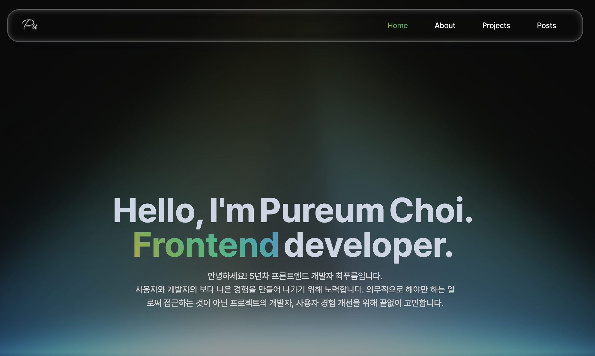

**[pureum.me](https://www.pureum.site/)**
 
my personal website by choipuruem
 

    
    

  

## License

<samp>code is licensed under <a href='./LICENSE'>MIT</a>,  words and images are licensed under <a href='https://creativecommons.org/licenses/by-nc-sa/4.0/'>CC BY-NC-SA 4.0</a></samp>.
